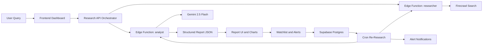

# StrategyRoom.ai

AI-powered investment research workspace that blends live web intelligence, structured financial analysis, portfolio watchlisting, and sector-wide scanning.


## Quick Navigation

- [Experience Snapshot](#experience-snapshot)
- [What and Why](#what-and-why)
- [Interactive Architecture Map](#interactive-architecture-map)
- [Feature Tour](#feature-tour)
- [Tech Stack Ribbons](#tech-stack-ribbons)
- [Run Locally](#run-locally)
- [Environment and Secrets](#environment-and-secrets)
- [Data Model and Security](#data-model-and-security)
- [Scripts](#scripts)
- [Testing](#testing)
- [Deployment Notes](#deployment-notes)

## Experience Snapshot

StrategyRoom.ai behaves like a compact research command center:

1. Search any company or ticker.
2. Watch a live two-agent timeline as research and analysis run.
3. Inspect a structured report with verdict, confidence, fundamentals, sentiment, risks, reasoning chain, and citations.
4. Save to watchlist, set alert rules, compare multiple names, and export reports.
5. Re-research runs on schedule and notifies you when key signals change.

## What and Why

### What it does

It converts a plain-language query into an explainable investment report with consistent structure:

- Verdict: Buy, Hold, Sell
- Confidence score plus confidence breakdown factors
- Executive summary
- Fundamentals and data visualizations
- Sentiment analysis and analyst consensus signal
- Risk factors
- Source links and AI reasoning chain

### Why it exists

Equity research is often fragmented across news sites, reports, and dashboards. StrategyRoom.ai is designed to close that gap by making research:

- Faster: automated source collection and synthesis
- More explainable: reasoning chain and confidence decomposition
- More actionable: watchlist persistence, alerts, and comparison views
- More continuous: scheduled re-research and notifications

## Interactive Architecture Map



## Feature Tour

### Core flows

- Auth flow with Google OAuth and email/password
- Company research and structured report generation
- Sector scan across top companies with confidence ranking
- Watchlist cards with quick refresh and compare actions
- Alert settings for verdict change, sentiment shift, confidence drop
- Notification bell with unread tracking
- Export as PDF and PNG, plus quick summary copy

### Primary app routes

- App shell and protected routing: src/App.tsx
- Main dashboard: src/pages/Index.tsx
- Comparison mode: src/pages/ComparisonView.tsx
- Sector analysis: src/pages/SectorView.tsx
- Login flow: src/pages/LoginPage.tsx

### Key feature modules

- Report composition: src/components/ReportPanel.tsx
- Live activity timeline: src/components/AgentActivityFeed.tsx
- Watchlist interaction: src/components/WatchlistPanel.tsx
- Alert controls: src/components/AlertSettings.tsx
- Notifications panel: src/components/NotificationBell.tsx
- Export controls: src/components/ExportToolbar.tsx

## Tech Stack Ribbons

### Frontend ribbon


### Backend and AI ribbon


### Quality and delivery ribbon


Note on Python: this repository is TypeScript-first across frontend and edge functions, with no Python runtime used in the current codebase.

## Run Locally

### Prerequisites

- Node.js 18+
- npm 9+
- A Supabase project (cloud or local)
- Firecrawl and Gemini API keys

### Quick start

```bash
npm install
npm run dev
```

Default local app port is 8080.

## Environment and Secrets

### Frontend environment variables

Create a .env file in project root:

```bash
VITE_SUPABASE_URL=your_supabase_url
VITE_SUPABASE_PUBLISHABLE_KEY=your_supabase_anon_key
```

### Supabase edge function secrets

- FIRECRAWL_API_KEY
- GOOGLE_API_KEY
- SUPABASE_URL
- SUPABASE_SERVICE_ROLE_KEY
- CRON_SECRET (recommended)

## Data Model and Security

### Tables

- research_history
- watchlist
- alert_settings
- alert_notifications

### Security model

- Row-Level Security is enabled on user-owned tables.
- Policies ensure each user can only read and write their own records.
- Unique constraints prevent duplicate ticker entries per user in watchlist and alert settings.

### Migrations

- supabase/migrations/20260220_research_history.sql
- supabase/migrations/20260222_watchlist.sql
- supabase/migrations/20260223_alerts.sql

## Scripts

- npm run dev: start development server
- npm run build: production build
- npm run build:dev: development-mode build
- npm run preview: preview production output
- npm run lint: run ESLint
- npm run test: run tests once
- npm run test:watch: run tests in watch mode

## Testing

Current tests validate:

- Financial parsing logic for chart metrics
- Glossary term completeness and lookup normalization

Test files:

- src/test/charts.test.ts
- src/test/glossary.test.ts

## Deployment Notes

- SPA rewrite is configured in vercel.json.
- PWA support is enabled with vite-plugin-pwa.
- Current function config includes verify_jwt = false for several edge functions; production hardening should enforce stricter invocation controls and secret-gated cron access.

## Final Product Summary

StrategyRoom.ai is an explainable AI research cockpit for equity decisions. It does not just generate one-off output; it supports the full lifecycle of research, monitoring, and signal-change awareness.
